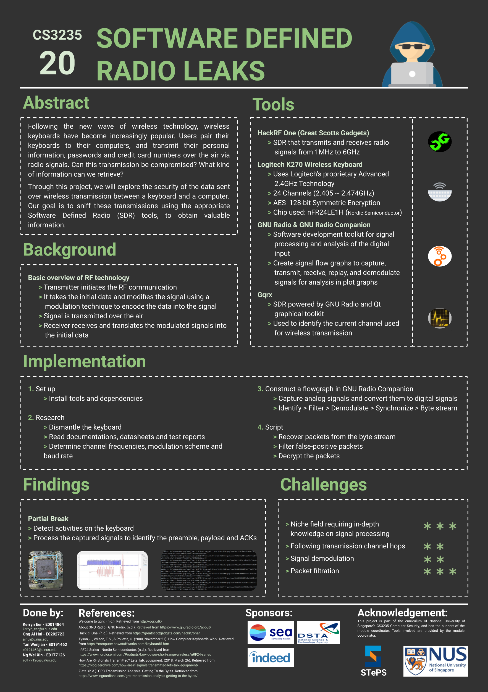

# CS3235 Project (AY19/20 S1 Group 20)
# Software Defined Radio Leaks

As part of CS3235 Computer Security module at National University of Singapore, we used an appropriate Software Defined Radio to sniff and make sense of the information transmitted between 2.4Ghz Wireless keyboard and a computer with the aim of exploring the security of wireless transmission.  

We managed to achieve a partial break by being able to detect and capture keypresses on the keyboard. However, we faced difficulty in decrypting these keypresses to obtain valuable information without the private key.  

We are proud to clinched first place at NUS School of Computing Term Project Showcase (15th STEPS) for CS3235 Computer Security module.

## This repository includes:
* Report – containing our research, implementation details and findings.
* Poster – a summary of our project
* GNU Radio file – to capture and demodulate the signals transmitted
* Python script – for cleaning up the data sniffed from the wireless transmission

## Tools used:
* HackRF One
* Logitech K270 Wireless Keyboard
* GNU Radio & GNU Radio Companion
* GQRX

